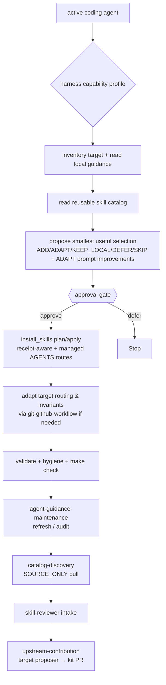

# Design

## Goal

Upgrade an arbitrary software repository with the smallest useful set of curated
agent skills and operating guidance while preserving that repository's local
authority.

## Architecture

```text
active coding agent
  -> identify its instruction and skill capabilities
  -> inspect target repository and existing guidance
  -> read reusable skill catalog
  -> propose selection and integration plan
  -> stop for approval
  -> install approved skills with deterministic receipt-aware helper
  -> persist maintenance routing and source resolution
  -> adapt target-local routing and invariants
  -> validate and report evidence
```

The agent owns interpretation and reconciliation because those tasks depend on
project meaning. Scripts own repeatable mechanical checks because those tasks
benefit from determinism.



## Guidance hierarchy

```text
root AGENTS.md and harness entrypoints
  -> thin pointers

.agents/AGENTS.md
  -> project invariants and task-to-skill routing

.agents/OPERATING.md
  -> small always-on behavior

.agents/skills/*/SKILL.md
  -> deep task-triggered procedures
```

This hierarchy is a pattern, not a required filesystem rewrite. A consuming
project may have another canonical guidance layout. Bootstrap must preserve and
integrate with that layout rather than install a competing source of truth.

## Harness adaptation

Harness compatibility is capability-based. Bootstrap asks the active harness
how it discovers repository instructions and skills, how precedence and nested
scope work, whether it can follow canonical-file pointers, what reload behavior
is required, and how discovery can be verified. It then chooses the thinnest
working projection.

Product-specific profiles document known behavior and test evidence, but they
are not a fixed compatibility allowlist. An unknown future harness can use
native discovery, a thin instruction pointer, a narrow projection, or a manual
entrypoint without requiring a new release of the kit. The repository keeps one
canonical owner for each rule or skill regardless of the adapter used.

## Safety model

- External and reusable guidance is input to review, not automatically trusted
  policy.
- Inventory and planning are read-only.
- Adoption is approval-gated.
- Mechanical adoption is create-only for new content and receipt-aware for
  updates; it preflights every skill and managed-route conflict before writing.
- A prior receipt permits refresh only while target content still matches the
  previously adopted digest. Local divergence fails closed.
- A refresh may remove only paths explicitly recorded as receipt-owned. Files
  omitted from the receipt remain target-owned and are preserved, even when
  the source manifest intentionally excludes them.
- Existing target guidance remains authoritative.
- Scripts do not execute imported content or access networks, credentials,
  databases, logs, or application state.
